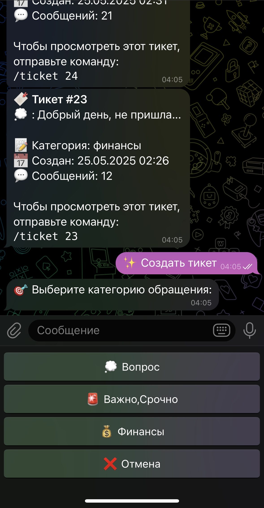
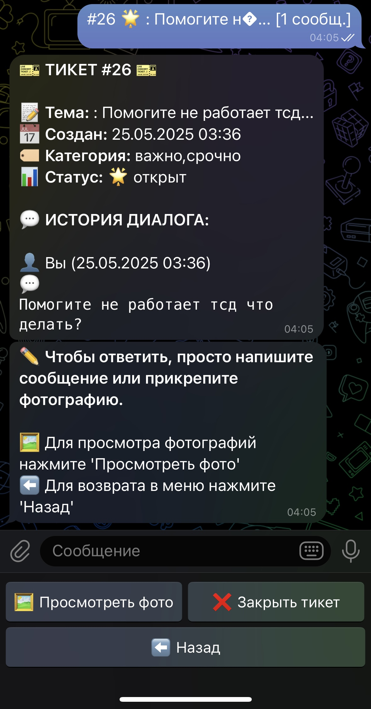
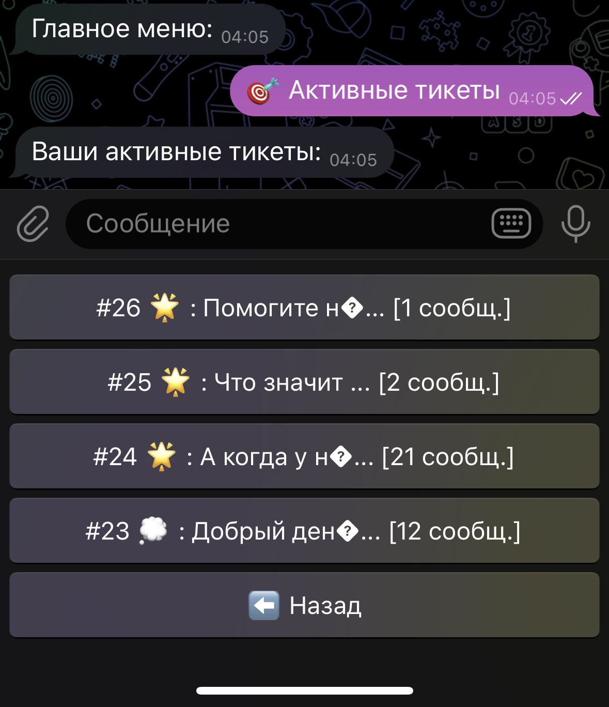

# 🤖 SupportBotFor1d


Многофункциональный Telegram-бот для поддержки пользователей с системой тикетов, регистрацией, историей обращений, вложениями и интеграцией с внешними сервисами.

---

## 📚 Содержание
- [Возможности](#возможности)
- [Структура базы данных](#структура-базы-данных)
- [Клавиатуры и сценарии](#клавиатуры-и-сценарии)
- [Установка и запуск](#установка-и-запуск)
- [Конфигурация](#конфигурация)
- [API для интеграции](#api-для-интеграции)
- [Структура проекта](#структура-проекта)
- [Скриншоты](#скриншоты)
- [Вклад и поддержка](#вклад-и-поддержка)

---

## ✨ Возможности

- Регистрация пользователей с валидацией ФИО, телефона, даты рождения, геолокации
- Создание тикетов с выбором категории (💭 Вопрос, 🚨 Важно/Срочно, 💰 Финансы)
- Просмотр активных тикетов и истории обращений
- Ведение диалога по тикету, обмен сообщениями и фотографиями
- Закрытие тикетов
- Интеграция с внешними сервисами через API (`/superconnect`)
- Хранение данных в PostgreSQL
- Гибкая настройка через `config.json`
- Логирование событий

---

## 🗄️ Структура базы данных

- **users** — пользователи (id, ФИО, телефон, координаты, дата рождения, статус регистрации)
- **tickets** — тикеты (id, user_id, заголовок, описание, статус, категория, даты создания/закрытия)
- **ticket_messages** — сообщения в тикетах (id, ticket_id, тип отправителя, id отправителя, текст, дата)
- **ticket_photos** — фотографии, прикрепленные к тикетам

<details>
<summary>Пример SQL-схемы</summary>

```sql
CREATE TABLE IF NOT EXISTS users (...);
CREATE TABLE IF NOT EXISTS tickets (...);
CREATE TABLE IF NOT EXISTS ticket_messages (...);
CREATE TABLE IF NOT EXISTS ticket_photos (...);
```

</details>

---

## 🖱️ Клавиатуры и сценарии

### Главное меню

- 🎯 Активные тикеты
- 📚 История тикетов
- ✨ Создать тикет

### Категории тикетов
- 💭 Вопрос
- 🚨 Важно,Срочно
- 💰 Финансы
- ❌ Отмена

### Пример inline-клавиатуры для тикета

| 📷 Фото | 📈 Статус |
|---------|----------|
| 💬 Ответить | 🔒 Закрыть |

### Основные команды
- `/start` — запуск и регистрация
- `/help` — справка

---

## 🚀 Установка и запуск

1. **Клонируйте репозиторий:**
   ```bash
   git clone https://github.com/mbutakov/SupportBotFor1d.git
   cd SupportBotFor1d
   ```
2. **Установите зависимости:**
   ```bash
   go mod download
   ```
3. **Настройте базу данных PostgreSQL** (создайте пользователя и БД, примените `base.sql`):
   ```bash
   psql -U postgres
   # CREATE USER botuser WITH PASSWORD 'password';
   # CREATE DATABASE supportbot OWNER botuser;
   # \q
   psql -U botuser -d supportbot -f base.sql
   ```
4. **Создайте и настройте `config.json`:**
   ```json
   {
     "telegram_token": "ВАШ_ТОКЕН",
     "database": {
       "host": "localhost",
       "port": 5432,
       "user": "botuser",
       "password": "password",
       "dbname": "supportbot",
       "sslmode": "disable"
     },
     "log_file": "bot.log",
     "secure_webhook_token": "ВАШ_WEBHOOK_ТОКЕН",
     "super_connect_token": "ВАШ_SUPERCONNECT_ТОКЕН"
   }
   ```
5. **Запустите бота:**
   - В режиме long polling:
     ```bash
     go run main.go
     ```
   - В режиме webhook:
     ```bash
     go run main.go -webhook="https://your-domain.com" -port="8443"
     ```

---

## ⚙️ Конфигурация

- Все параметры настраиваются через `config.json` (см. выше)
- Для работы требуется PostgreSQL
- Для webhook-режима нужен публичный домен и SSL

---

## 🔌 API для интеграции

**POST** `/superconnect`

- `sender_id` — ID отправителя
- `message` — текст сообщения
- `accepter_id` — ID получателя
- `super_connect_token` — токен авторизации

Пример запроса:
```bash
curl -X POST https://your-domain.com/superconnect \
  -d "sender_id=123" \
  -d "message=Привет!" \
  -d "accepter_id=456" \
  -d "super_connect_token=ВАШ_ТОКЕН"
```

---

## 📁 Структура проекта

```
.
├── main.go              # Точка входа
├── base.sql             # SQL-схема БД
├── config.json          # Конфиг
├── bot/                 # Логика бота (обработчики, клавиатуры)
├── config/              # Работа с конфигом
├── database/            # Работа с БД
├── logger/              # Логирование
```

---

## 📸 Скриншоты

<details>
<summary>Главное меню</summary>



</details>

<details>
<summary>Создание тикета</summary>



</details>

<details>
<summary>Диалог по тикету</summary>



</details>

---

## 🤝 Вклад и поддержка

- Pull requests приветствуются!
- Вопросы — через Issues.
- Для связи: создайте Issue или используйте контакты, указанные в профиле.

---

Разработано с ❤️ для поддержки пользователей. 